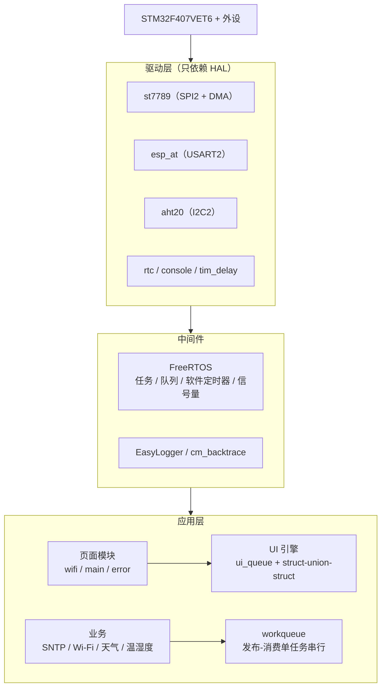
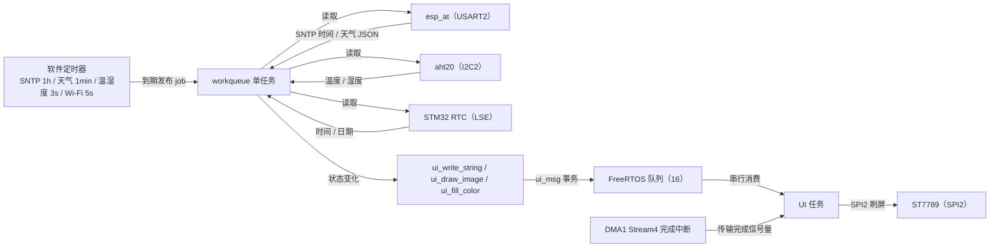

# STM32F407 天气时钟（FreeRTOS + ESP-AT）

基于 FreeRTOS 的桌面天气时钟。STM32F407VET6 主控，通过 ESP32-C3（ESP-AT 固件）联网，获取心知天气实时天气与 SNTP 网络时间，结合 AHT20 采集室内温湿度，在 240x320 ST7789 LCD 上分页显示。

技术栈：C99 · STM32F4 标准外设库 · FreeRTOS · EasyLogger · cm_backtrace · Keil MDK-ARM

<!-- 效果图：补充实物照片后放在 docs/ 目录并替换下面这行

-->

<!-- 视频示例：把 demo.mp4 放到 docs/ 目录后取消下面这行注释
<video src="docs/demo.mp4" controls="controls" width="480"></video>
-->

## 功能特性

- 多页面 UI：Wi-Fi 连接页、主页面、错误页；welcome 页组件已实现、暂未接入主流程
- 联网天气：心知天气 `now` API，默认每 1 分钟轮询，天气 code 自动映射对应图标
- 网络授时：`AT+CIPSNTPCFG=1,8` 获取北京时间，每小时校准一次 RTC，失败 1 秒后重试
- 室内环境：AHT20 硬件 I2C2，每 3 秒后台刷新温度与湿度
- 实时显示：时间/日期每秒刷新，冒号按秒闪烁
- 调试体系：EasyLogger 日志（互斥锁串行输出，等级/Tag/时间/任务名）、cm_backtrace 故障定位、`vTaskList` 任务状态探针

## 硬件连接

| 外设 | 接口 | STM32 引脚 |
| --- | --- | --- |
| ESP32-C3（ESP-AT 固件） | USART2 @ 115200 | TX = PA2（接模组 RX），RX = PA3（接模组 TX） |
| ST7789 LCD | SPI2 + 控制引脚 | CLK = PB13，MOSI = PC3，MISO = PC2，CS = PE2，RST = PE3，DC = PE4，BL = PE5 |
| AHT20 温湿度 | I2C2 | SCL = PB10，SDA = PB11 |
| 调试串口 | USART1 @ 115200 | TX = PA9，RX = PA10 |

## 系统架构

分为三层：驱动层、中间件层、应用层。



- 驱动层自包含，每个模块一个子目录，对外只暴露 `init/read/write` 类 API，应用层不直接操作寄存器。
- 应用层拆成两条线：业务线把低频任务投到 workqueue 串行执行；渲染线由 UI 任务独占 LCD。
- FreeRTOS、EasyLogger、cm_backtrace 作为中间件，业务代码只调用其 API。

## 数据流



秒级时间刷新（1s）由软件定时器直接驱动，其余非实时业务经 workqueue 串行执行；UI 更新统一进入队列，由 UI 任务独占 LCD 渲染。

## 项目亮点

**无锁 UI 引擎（struct-union-struct + FreeRTOS 队列）**

`app/ui.c` 用 `action + union` 定义填充、文字、图标三类最小 UI 事务，业务任务只投递 `ui_msg`，UI 任务独占 LCD 串行执行。字符串写入时 `pvPortMalloc` 拷贝、UI 任务渲染后释放，避免指针悬垂；多任务共享屏幕不需要互斥锁，也不存在优先级翻转。

**发布-消费式业务调度（workqueue）**

SNTP、Wi-Fi、天气、温湿度不各自建任务：软件定时器到期后把 job 投递到 workqueue，单后台任务按序执行。业务任务栈只分配一次，任务数量少、系统资源占用低。

**ST7789 SPI + DMA 刷屏**

SPI2 时钟 10.5 MHz（APB1 42 MHz / 4），GRAM 写入走 DMA1 Stream4：16-bit 数据、FIFO 使能。整块同色填充时关闭内存递增，DMA 反复读取同一个颜色值即可刷满区域；DMA 完成中断释放信号量，UI 任务阻塞等待，不忙等、不阻塞其他任务调度。

**ESP-AT 命令可靠性**

USART2 115200 与 ESP-AT 模组通信：接收按行匹配 `OK / ERROR / busy / ready`，超时从命令发送前开始计时，覆盖整条命令发送耗时；1 KB 接收缓存保留完整响应供 SNTP/天气解析，异常可被上层感知并重试。

**AHT20 后台采样**

硬件 I2C2 事件等待带超时宏，测量在 workqueue 后台执行，失败只打日志并跳过本次 UI 更新，不影响时钟与天气显示。

**RTC + SNTP 校准**

RTC 使用 LSE 32.768 kHz 晶振；每小时 `AT+CIPSNTPTIME?` 拉取北京时间（时区 +8），年份校验后写回 RTC，失败 1 秒后重试，避免长时间运行后时间漂移。

**调试三件套**

EasyLogger 用互斥锁串行化多任务日志输出，统一格式（等级/Tag/时间/任务名）；cm_backtrace 在断言、栈溢出、硬件故障时输出调用栈；`state_probe` 每 2 秒用 `vTaskList` 打印全部任务状态与栈高水位，便于调优。

## 目录结构

```
my_freertos_weather_clock/
├── app/                     # 应用层
│   ├── main.c               # 入口：cm_backtrace、board 初始化、任务创建
│   ├── app.c                # 业务调度：软件定时器 + workqueue
│   ├── board.c              # 时钟/外设 RCC、printf 重定向、异常钩子
│   ├── ui.c                 # UI 引擎：队列 + struct-union-struct 事务
│   ├── workqueue.c          # 发布-消费工作队列
│   ├── weather.c            # 心知天气 JSON 解析
│   ├── wifi.c               # Wi-Fi 初始化与连接流程
│   ├── font/                # Maple 位图字库（GB2312 汉字 + ASCII，多字号）
│   ├── image/               # 天气/状态图标位图
│   └── page/                # welcome / wifi / main / error 页面
├── driver/                  # 自包含外设驱动（只依赖 HAL）
│   ├── aht20/               # 温湿度传感器，硬件 I2C2
│   ├── console/             # 调试串口 USART1（RX 中断 + 回调）
│   ├── esp_at/              # ESP32-C3 ESP-AT：Wi-Fi / SNTP / HTTP
│   ├── rtc/                 # 内部 RTC（LSE 晶振）
│   ├── st7789/              # LCD 驱动（SPI2 + DMA）
│   └── tim_delay/           # 高精度延时与毫秒/微秒时间戳
├── firmware/                # STM32F4 HAL/CMSIS（供应商只读，不修改）
├── mdk/                     # Keil µVision 工程（stm32f407.uvprojx）
├── third_lib/               # FreeRTOS / EasyLogger / cm_backtrace
├── tools/                   # 字库转换脚本
└── resources/               # 资源素材
```

## 开源组件

- [FreeRTOS](https://github.com/FreeRTOS/FreeRTOS) - MIT License
- [EasyLogger](https://github.com/armink/EasyLogger) - MIT License
- [cm_backtrace](https://github.com/armink/CmBacktrace) - MIT License

本项目对以上组件做了移植与集成，保留原始版权与 License 头。

## 构建与烧录

- 工具链：Keil MDK-ARM（µVision 5），工程引用 `Keil.STM32F4xx_DFP`（3.1.1）
- 打开 `mdk/stm32f407.uvprojx`，配置调试器（ST-Link / J-Link）后按 F7 构建、F8 下载
- 目标芯片：STM32F407VETx（512 KB Flash，8 MHz HSE）
- 日志输出：USART1，115200 8N1
- 重新生成字库：`python tools/convert_chinese_font.py`

## 使用前配置

> 公开仓库上传前必读

- `app/app.h` 中的 `WIFI_SSID` / `WIFI_PASSWD` 是明文个人凭据，公开上传前替换为占位符或外部配置。
- `app/app.c` 天气 URL 中的心知天气 `key` 参数是明文 API Key，建议上传前轮换，并抽成配置。
- `mdk/Objects/`、`mdk/Listings/`、`*.uvguix.*` 等构建产物不要提交，建议先补 `.gitignore`。

## 待办 / 可改进

- 实测 SPI 刷新率与初始化耗时，补充性能数据
- 补充实物照片
- 把 API Key / Wi-Fi 凭据抽成配置
- welcome 页接入主流程
